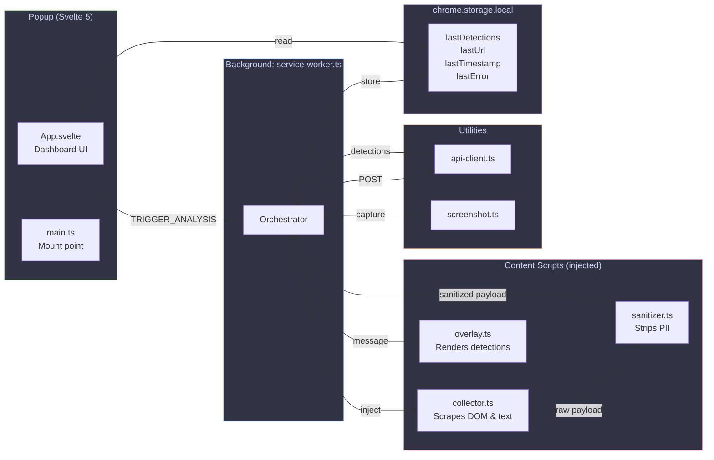
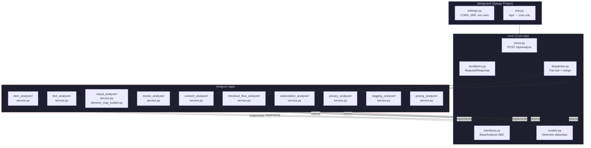
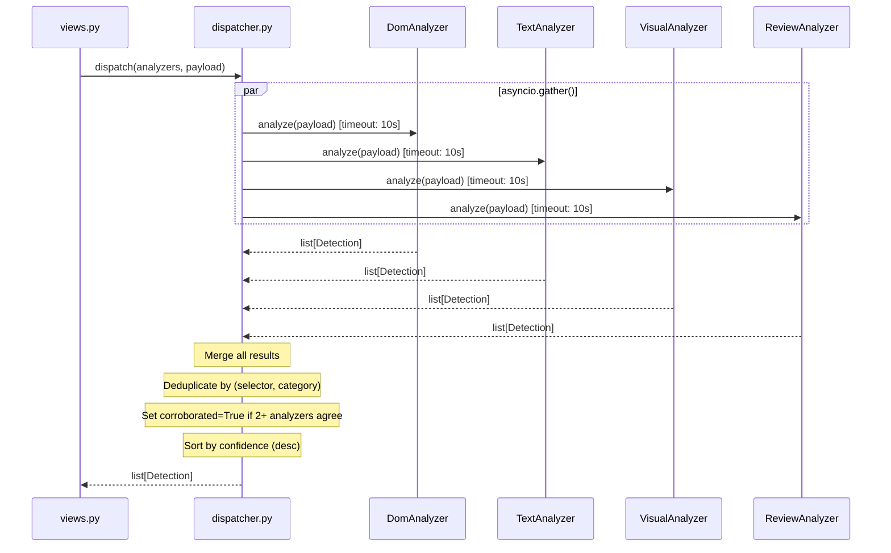

# Architecture

> System-level architecture of DarkGuard showing component relationships, module boundaries, and technology choices.

## High-Level System Architecture

```mermaid
graph TB
    subgraph Browser["Chrome Browser"]
        User["👤 User clicks extension icon"]
        SW["Service Worker<br/><i>Orchestrator</i>"]
        CS["Content Script<br/><i>Collector + Sanitizer</i>"]
        OV["Content Script<br/><i>Overlay Renderer</i>"]
        POP["Popup<br/><i>Svelte 5 Dashboard</i>"]
        STORE["chrome.storage.local"]
    end

    subgraph Backend["Django Backend (stateless)"]
        API["POST /api/analyze<br/><i>DRF ViewSet</i>"]
        DISP["Dispatcher<br/><i>asyncio.gather()</i>"]
        DOM["DOM Analyzer<br/><i>Rules Engine</i>"]
        TXT["Text Analyzer<br/><i>Regex + NLP</i>"]
        VIS["Visual Analyzer<br/><i>ElementMap → LLM</i>"]
        REV["Review Analyzer<br/><i>Heuristics + LLM</i>"]
        CON["Consent Analyzer<br/><i>Rules</i>"]
        CHK["Checkout Analyzer<br/><i>Rules</i>"]
        SUB["Subscription Analyzer<br/><i>LLM</i>"]
        PRV["Privacy Analyzer<br/><i>Rules</i>"]
        NAG["Nagging Analyzer<br/><i>Rules</i>"]
        PRC["Pricing Analyzer<br/><i>LLM</i>"]
    end

    subgraph External["External Services"]
        GEMINI["Google Gemini API<br/><i>gemini-2.5-flash</i>"]
    end

    User -->|"action.onClicked"| SW
    SW -->|"chrome.scripting.executeScript"| CS
    SW -->|"chrome.tabs.captureVisibleTab"| SCREENSHOT["📸 Screenshot"]
    CS -->|"Sanitized payload"| SW
    SW -->|"POST JSON"| API
    API --> DISP
    DISP -->|"asyncio.wait_for(10s)"| DOM
    DISP -->|"asyncio.wait_for(10s)"| TXT
    DISP -->|"asyncio.wait_for(10s)"| VIS
    DISP -->|"asyncio.wait_for(10s)"| REV\n    DISP -->|"asyncio.wait_for(10s)"| CON\n    DISP -->|"asyncio.wait_for(10s)"| CHK\n    DISP -->|"asyncio.wait_for(10s)"| SUB\n    DISP -->|"asyncio.wait_for(10s)"| PRV\n    DISP -->|"asyncio.wait_for(10s)"| NAG\n    DISP -->|"asyncio.wait_for(10s)"| PRC
    VIS -->|"ElementMap prompt"| GEMINI
    REV -->|"Review text prompt"| GEMINI
    DISP -->|"Merged detections"| API
    API -->|"JSON response"| SW
    SW -->|"Store results"| STORE
    SW -->|"Send detections"| OV
    POP -->|"Read results"| STORE

    style Browser fill:#313244,stroke:#89b4fa,color:#cdd6f4
    style Backend fill:#1e1e2e,stroke:#a6e3a1,color:#cdd6f4
    style External fill:#1e1e2e,stroke:#fab387,color:#cdd6f4
```

## Extension Internal Architecture



## Backend Internal Architecture



## Dispatcher Concurrency Model



## Technology Stack

| Layer | Technology | Version | Purpose |
|---|---|---|---|
| Extension UI | Svelte 5 | 5.x | Reactive popup components |
| Extension Build | Vite | 6.x | Fast bundling, 3 entry points |
| Extension Types | TypeScript | 5.7+ | Strict mode, no `any` types |
| Extension Platform | Chrome MV3 | — | Service worker + content scripts |
| Backend Framework | Django | 5.x | URL routing, settings, WSGI |
| Backend API | Django REST Framework | 3.x | Serialization, validation |
| Backend Concurrency | asyncio | stdlib | Parallel analyzer execution |
| AI/ML | Google GenAI (Gemini 2.5 Flash) | — | Visual + review analysis |
| CORS | django-cors-headers | 4.x | Locked to `chrome-extension://*` |

## Module Boundaries

Each analyzer is a **standalone Django app** with its own:
- `__init__.py` — app marker
- `interfaces.py` — payload/result types
- `service.py` — `BaseAnalyzer` implementation
- `serializers.py` — DRF serializers
- `tests/` — unit test suite

This enforces the **modular architecture rule**: concerns are never mixed across analyzers. Adding a new analyzer is done via the `/add-analyzer` workflow.
