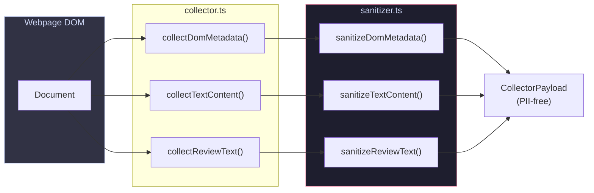
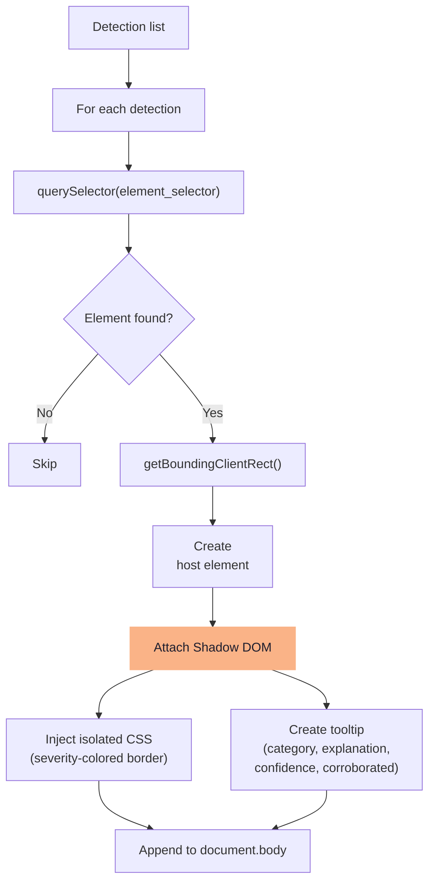

# Data Flow

> End-to-end walkthrough of how data moves through DarkGuard, from user click to overlay rendering.

## Complete Pipeline

```mermaid
flowchart TD
    A["👤 User clicks DarkGuard icon"] --> B["Service Worker receives<br/>action.onClicked event"]
    B --> C["Inject content script<br/>via chrome.scripting.executeScript"]
    C --> D["collector.ts scrapes DOM"]
    
    D --> D1["Hidden elements<br/>(display:none, visibility:hidden)"]
    D --> D2["Interactive elements<br/>(buttons, links + styles)"]
    D --> D3["Pre-checked inputs<br/>(checkbox/radio with checked)"]
    D --> D4["Text content<br/>(labels, headings, body)"]
    D --> D5["Review text<br/>(review containers)"]\n    D --> D6["Checkout flow<br/>(pricing, cart)"]\n    D --> D7["Nagging events<br/>(overlays, toasts)"]

    D1 & D2 & D3 & D4 & D5 & D6 & D7 --> E["sanitizer.ts strips PII"]
    
    E --> E1["Redact emails → [REDACTED]"]
    E --> E2["Redact phones → [REDACTED]"]
    E --> E3["Redact SSNs → [REDACTED]"]
    E --> E4["Strip sensitive form values"]

    E1 & E2 & E3 & E4 --> F["Sanitized CollectorPayload"]
    
    B --> G["screenshot.ts captures<br/>visible tab as base64 PNG"]
    
    F & G --> H["Service Worker builds<br/>AnalyzeRequest"]
    
    H --> I["api-client.ts POSTs to<br/>Django backend"]
    
    I --> J["Backend Dispatcher"]
    
    J --> K["10 analyzers run in parallel"]
    
    K --> L["Merge + Deduplicate +<br/>Corroborate + Sort"]
    
    L --> M["AnalyzeResponse<br/>returned to extension"]
    
    M --> N["Store in chrome.storage.local"]
    M --> O["Send detections to<br/>overlay.ts via message"]
    
    N --> P["Popup reads & displays<br/>detection summary"]
    O --> Q["overlay.ts renders<br/>Shadow DOM overlays"]

    style A fill:#89b4fa,stroke:#89b4fa,color:#1e1e2e
    style E fill:#f38ba8,stroke:#f38ba8,color:#1e1e2e
    style J fill:#a6e3a1,stroke:#a6e3a1,color:#1e1e2e
    style Q fill:#fab387,stroke:#fab387,color:#1e1e2e
```

## Phase 1: Signal Collection (Browser-Side)



### What Gets Collected

| Field | Source | Content |
|---|---|---|
| `dom_metadata.hidden_elements` | `querySelectorAll('[style*="display:none"], [hidden], .hidden')` | Selector, tag, text, styles |
| `dom_metadata.interactive_elements` | `querySelectorAll('button, a, [role="button"], input[type="submit"]')` | Selector, tag, text, bounding rect, computed styles |
| `dom_metadata.prechecked_inputs` | `querySelectorAll('input[checked]')` | Selector, tag, attributes |
| `text_content.button_labels` | All interactive elements | `{selector, text}` pairs |
| `text_content.headings` | `querySelectorAll('h1, h2, h3, h4, h5, h6')` | `{selector, text}` pairs |
| `text_content.body_text` | `document.body.innerText` (truncated) | First 5000 chars |
| `review_text` | `querySelectorAll('[itemprop="reviewBody"], .review-text')` | Concatenated review bodies |

## Phase 2: Backend Analysis

```mermaid
flowchart TD
    REQ["AnalyzeRequest"] --> VALID["AnalyzeRequestSerializer<br/>validates payload"]
    VALID --> DISP["dispatcher.dispatch()"]
    
    DISP --> |"asyncio.gather()"| FORK["Fan-out to 10 analyzers"]
    
    FORK --> DOM["DomAnalyzerService.analyze()"]
    FORK --> TXT["TextAnalyzerService.analyze()"]
    FORK --> VIS["VisualAnalyzerService.analyze()"]
    FORK --> REV["ReviewAnalyzerService.analyze()"]
    FORK --> CON["ConsentAnalyzerService.analyze()"]
    FORK --> CHK["CheckoutFlowAnalyzerService.analyze()"]
    FORK --> SUB["SubscriptionAnalyzerService.analyze()"]
    FORK --> PRV["PrivacyAnalyzerService.analyze()"]
    FORK --> NAG["NaggingAnalyzerService.analyze()"]
    FORK --> PRC["PricingAnalyzerService.analyze()"]

    DOM --> DOM_R\n    CON --> CON_R\n    CHK --> CHK_R\n    SUB --> SUB_R\n    PRV --> PRV_R\n    NAG --> NAG_R\n    PRC --> PRC_R["Detections:<br/>preselection,<br/>visual_interference"]
    TXT --> TXT_R["Detections:<br/>confirmshaming,<br/>urgency_scarcity,<br/>misdirection"]
    VIS --> VIS_R["Detections:<br/>visual_interference,<br/>misdirection"]
    REV --> REV_R["Detections:<br/>fake_social_proof"]

    DOM_R & TXT_R & VIS_R & REV_R & CON_R & CHK_R & SUB_R & PRV_R & NAG_R & PRC_R --> MERGE["Merge all detections"]
    MERGE --> DEDUP["Deduplicate by<br/>(element_selector, category)"]
    DEDUP --> CORR["Set corroborated=True<br/>if 2+ analyzers flagged same"]
    CORR --> SORT["Sort by confidence DESC"]
    SORT --> RESP["AnalyzeResponse"]

    style DISP fill:#a6e3a1,stroke:#a6e3a1,color:#1e1e2e
    style CORR fill:#cba6f7,stroke:#cba6f7,color:#1e1e2e
```

## Phase 3: Overlay Rendering



### Overlay Color Coding

| Severity | Border Color | Hex |
|---|---|---|
| 🔴 High | Red | `#f38ba8` |
| 🟠 Medium | Orange | `#fab387` |
| 🔵 Low | Blue | `#89b4fa` |

## Data Shape Reference

### AnalyzeRequest (Extension → Backend)

```json
{
  "url": "https://example.com/product",
  "dom_metadata": {
    "hidden_elements": [...],
    "interactive_elements": [...],
    "prechecked_inputs": [...]
  },
  "text_content": {
    "button_labels": [{"selector": "#btn", "text": "Buy Now"}],
    "headings": [{"selector": "h1", "text": "Flash Sale!"}],
    "body_text": "Only 3 left in stock..."
  },
  "screenshot_b64": "data:image/png;base64,...",
  "review_text": "Amazing product!---Great item!---Must buy!"
}
```

### AnalyzeResponse (Backend → Extension)

```json
{
  "detections": [
    {
      "category": "urgency_scarcity",
      "element_selector": "body",
      "confidence": 0.85,
      "explanation": "Urgency language detected: \"Only 3 left in stock\"",
      "severity": "medium",
      "corroborated": false,
      "user_feedback": null
    }
  ]
}
```
